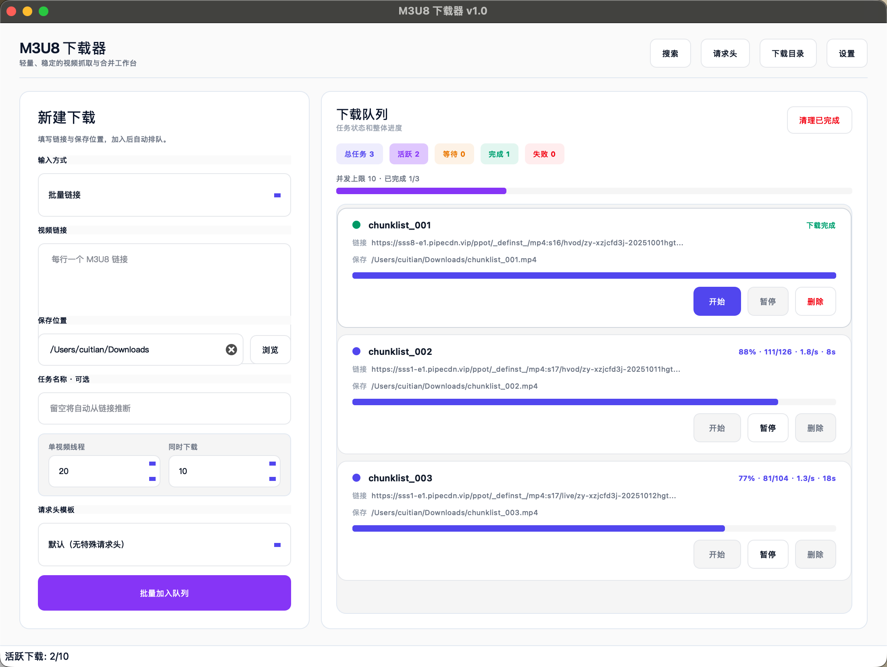

# M3U8 下载器

跨平台桌面端 M3U8 / HLS 下载工具：简约工作台界面，支持多线程拉流、AES 解密、FFmpeg 合并，并内置可选的片源搜索。

[](https://python.org)
[](https://wiki.qt.io/Qt_for_Python)
[](LICENSE)

## 功能

- **简约界面**：现代工作台布局，多套主题可切换
- **多线程下载**：可配置单任务线程数与同时下载任务数
- **加密流支持**：自动识别 AES-128 HLS 加密、预加载 Key 并输出解密阶段日志
- **FFmpeg 合并**：优先用 FFmpeg 合并 TS，减少音画不同步；无 FFmpeg 时走备用合并
- **请求头 / 代理**：自定义 Header、请求头模板，适配部分防盗链站点
- **任务队列**：进度总览、状态统计、清理已完成任务
- **安全退出**：退出时停止未完成任务，清理已下载分片和合并半成品
- **实时日志**：主界面与搜索窗口可切换查看运行日志
- **动态视觉**：主题色粒子、轨道核心、交互柔光和按钮扫光，可在设置中关闭
- **片源搜索（可选）**：爱瓜 / 魔法影视 / 爱壹帆 / 努努影院，搜索后提取 M3U8 再下载

## 界面预览



## 环境要求

- Python 3.8+
- Windows / macOS / Linux
- 建议安装 [FFmpeg](https://ffmpeg.org/)（详见 [FFMPEG_SETUP.md](FFMPEG_SETUP.md)）

## 安装与运行

```bash
git clone https://github.com/shayuaidoudou/m3u8-downloader.git
cd m3u8-downloader
pip install -r requirements.txt
python main.py
```

也可使用启动器（会先检查依赖）：

```bash
python launcher.py
# 或
python install.py
```

## 使用说明

### 直接下载

1. 选择输入方式（单个链接 / 批量等）
2. 粘贴 M3U8 链接，选择保存目录
3. 按需调整线程数、同时下载数、请求头模板
4. 点击「加入下载队列」

### 片源搜索

1. 顶部点击「搜索」，选择渠道与关键词
2. 选中结果后提取 M3U8（各渠道使用受控并发、节流或自动过盾）
3. 将链接加入下载队列；分片下载仍使用多线程

部分渠道可能需要 Cookie，或在触发 Cloudflare 时由内置浏览器辅助过验证。站点接口会变动，搜源功能不保证长期可用。

### 请求头

在「请求头」中配置 `Referer` / `User-Agent` 等，或选用内置模板，用于需要校验来源的视频源。

## 项目结构

```
├── main.py                 # GUI 入口
├── app/                    # GUI 组件与窗口编排
│   ├── main_window.py      # 主窗口组合入口与状态初始化
│   ├── main_window_ui.py   # 主窗口布局与视觉组件
│   ├── main_window_queue.py # 任务创建、调度与进度状态
│   ├── main_window_lifecycle.py # 托盘、菜单、日志与退出流程
│   ├── effects.py          # 工作区、能量核心与卡片边框动效
│   ├── button_effects.py   # 可复用按钮扫光覆盖层
│   ├── compose_effects.py  # 左侧配置栏背景的极光丝带动效
│   ├── widgets.py          # 任务卡片、下载线程、通用控件
│   ├── settings_dialog.py  # 偏好设置
│   ├── message_box.py      # 通用消息框
│   ├── headers_dialog.py   # 请求头编辑器
│   ├── search_dialog.py    # 搜索窗口组合入口
│   ├── search_dialog_view.py # 搜索界面、引擎切换与日志
│   ├── search_dialog_workflow.py # 搜索、提取与结果处理
│   ├── route_dialog.py     # 搜索信号与线路选择
│   └── ui_support.py       # 资源路径、字体与日志辅助
├── m3u8_downloader.py      # 下载与合并核心
├── config.py               # 默认配置与主题
├── utils.py                # 工具函数
├── launcher.py / install.py
├── search.py               # 搜索渠道统一入口
├── search_ncat.py          # NCat22
├── search_mofa.py          # 魔法影视
├── search_iyf.py           # 爱壹帆
├── search_nnyy.py          # 努努影院：首页、搜索、详情与线路接口
├── assets/
│   ├── favicon.ico
│   └── screenshot-main.png
├── test/                   # 单元测试
├── requirements.txt
├── FFMPEG_SETUP.md
└── LICENSE
```

## 测试

```bash
python -m pytest test/ -q
```

## 配置

常用默认项见 `config.py`（线程数、超时、窗口大小、动态特效等）。运行时偏好保存在本地 `settings.json`（已加入 `.gitignore`，不会提交）。「设置 → 界面设置」可单独关闭持续动画，静态主题和布局不会受影响。

## 注意事项

- 请仅下载你有权获取的内容，遵守当地法律与目标站点服务条款
- 搜源与自动过盾为辅助功能，可能随时失效，请勿用于未授权批量抓取
- 本项目按 MIT 许可提供，不提供任何可用性或合法性担保

## 贡献

欢迎 Issue / PR。建议：

1. Fork 后创建特性分支
2. 为行为变更补充或更新 `test/` 中的测试
3. 提交说明写清「为什么改」

## 相关链接

- [GitHub](https://github.com/shayuaidoudou/m3u8-downloader)
- [Issues](https://github.com/shayuaidoudou/m3u8-downloader/issues)
- [作者博客](https://blog.shayuaidoudou.store/)

## License

[MIT](LICENSE)
